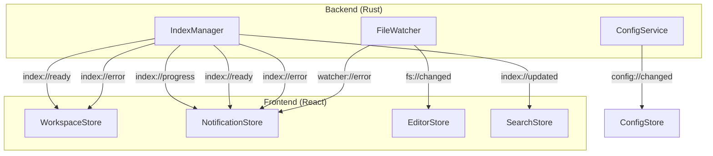

# 06. IPC通信詳細

Tauriコマンド（invoke）とイベント（emit/listen）の完全なAPI仕様。

---

## 1. IPCブリッジレイヤー

**ファイル:** `src/ipc/commands.ts`

全コマンドのinvokeをラップし、型安全なインターフェースを提供する。

```typescript
import { invoke } from '@tauri-apps/api/core';
import type { CommandError } from './types';

/** 全コマンドのエラーハンドリング共通ラッパー */
async function invokeCommand<T>(cmd: string, args?: Record<string, unknown>): Promise<T> {
  try {
    return await invoke<T>(cmd, args);
  } catch (error) {
    // Tauriはコマンドのエラーを文字列にシリアライズして返す
    // JSON文字列をパースしてCommandErrorに変換
    const commandError: CommandError = typeof error === 'string'
      ? JSON.parse(error)
      : { code: 'INTERNAL_ERROR', message: String(error) };
    throw commandError;
  }
}
```

---

## 2. コマンド定義

### 2.1 ワークスペース系

```typescript
// フォルダ選択ダイアログ
export async function selectDirectory(): Promise<string | null> {
  return invokeCommand<string | null>('select_directory');
}

// ワークスペースを開く
export async function openWorkspace(path: string): Promise<WorkspaceInfo> {
  return invokeCommand<WorkspaceInfo>('open_workspace', { path });
}

// ワークスペースを閉じる
export async function closeWorkspace(): Promise<void> {
  return invokeCommand<void>('close_workspace');
}

// 最近のワークスペース一覧
export async function listRecentWorkspaces(): Promise<Workspace[]> {
  return invokeCommand<Workspace[]>('list_recent_workspaces');
}
```

### 2.2 ファイル系

```typescript
// ファイルツリー取得
export async function getFileTree(path: string, depth?: number): Promise<FileNode[]> {
  return invokeCommand<FileNode[]>('get_file_tree', { path, depth: depth ?? 1 });
}

// ファイル読み込み
export async function readFile(path: string): Promise<FileContent> {
  return invokeCommand<FileContent>('read_file', { path });
}

// OSエクスプローラーで表示
export async function revealInOsExplorer(path: string): Promise<void> {
  return invokeCommand<void>('reveal_in_os_explorer', { path });
}

// 相対パス取得
export async function getRelativePath(path: string, posix?: boolean): Promise<string> {
  return invokeCommand<string>('get_relative_path', { path, posix: posix ?? false });
}
```

### 2.3 検索系

```typescript
// 全文検索
export async function searchFulltext(query: string, options: SearchOptions): Promise<SearchResult> {
  return invokeCommand<SearchResult>('search_fulltext', { query, options });
}

// インデックス再構築
export async function buildIndex(): Promise<void> {
  return invokeCommand<void>('build_index');
}

// インデックス状態取得
export async function getIndexStatus(): Promise<IndexStatus> {
  return invokeCommand<IndexStatus>('get_index_status');
}

// 検索履歴取得
export async function getSearchHistory(limit?: number): Promise<HistoryEntry[]> {
  return invokeCommand<HistoryEntry[]>('get_search_history', { limit: limit ?? 100 });
}

// ファイル名あいまい検索
export async function searchFiles(query: string, limit?: number): Promise<FileMatch[]> {
  return invokeCommand<FileMatch[]>('search_files', { query, limit: limit ?? 50 });
}
```

### 2.4 ブックマーク系

```typescript
// ブックマーク追加
export async function addBookmark(
  workspaceId: string, filePath: string, lineNumber: number,
  colorIndex: number, previewText?: string
): Promise<Bookmark> {
  return invokeCommand<Bookmark>('add_bookmark', {
    workspace_id: workspaceId, file_path: filePath,
    line_number: lineNumber, color_index: colorIndex, preview_text: previewText,
  });
}

// ブックマーク削除
export async function removeBookmark(id: number): Promise<void> {
  return invokeCommand<void>('remove_bookmark', { id });
}

// ブックマーク一覧取得
export async function getBookmarks(workspaceId: string): Promise<Bookmark[]> {
  return invokeCommand<Bookmark[]>('get_bookmarks', { workspace_id: workspaceId });
}

// 色別ブックマーク一括削除
export async function clearBookmarksByColor(workspaceId: string, colorIndex: number): Promise<void> {
  return invokeCommand<void>('clear_bookmarks_by_color', {
    workspace_id: workspaceId, color_index: colorIndex,
  });
}
```

### 2.5 設定系

```typescript
// 設定取得
export async function getConfig(): Promise<AppConfig> {
  return invokeCommand<AppConfig>('get_config');
}

// 設定更新
export async function updateConfig(config: AppConfig): Promise<AppConfig> {
  return invokeCommand<AppConfig>('update_config', { config });
}
```

---

## 3. イベント定義

**ファイル:** `src/ipc/events.ts`

```typescript
import { listen, type UnlistenFn } from '@tauri-apps/api/event';

/** イベントリスナー登録の共通ラッパー */
export function onIndexProgress(
  handler: (payload: IndexProgressPayload) => void
): Promise<UnlistenFn> {
  return listen<IndexProgressPayload>('index://progress', (event) => handler(event.payload));
}

export function onIndexReady(
  handler: (payload: IndexReadyPayload) => void
): Promise<UnlistenFn> {
  return listen<IndexReadyPayload>('index://ready', (event) => handler(event.payload));
}

export function onIndexError(
  handler: (payload: IndexErrorPayload) => void
): Promise<UnlistenFn> {
  return listen<IndexErrorPayload>('index://error', (event) => handler(event.payload));
}

export function onIndexUpdated(
  handler: (payload: IndexUpdatedPayload) => void
): Promise<UnlistenFn> {
  return listen<IndexUpdatedPayload>('index://updated', (event) => handler(event.payload));
}

export function onFsChanged(
  handler: (payload: FsChangedPayload) => void
): Promise<UnlistenFn> {
  return listen<FsChangedPayload>('fs://changed', (event) => handler(event.payload));
}

export function onConfigChanged(
  handler: (payload: ConfigChangedPayload) => void
): Promise<UnlistenFn> {
  return listen<ConfigChangedPayload>('config://changed', (event) => handler(event.payload));
}

export function onWatcherError(
  handler: (payload: WatcherErrorPayload) => void
): Promise<UnlistenFn> {
  return listen<WatcherErrorPayload>('watcher://error', (event) => handler(event.payload));
}
```

---

## 4. イベントフロー図


