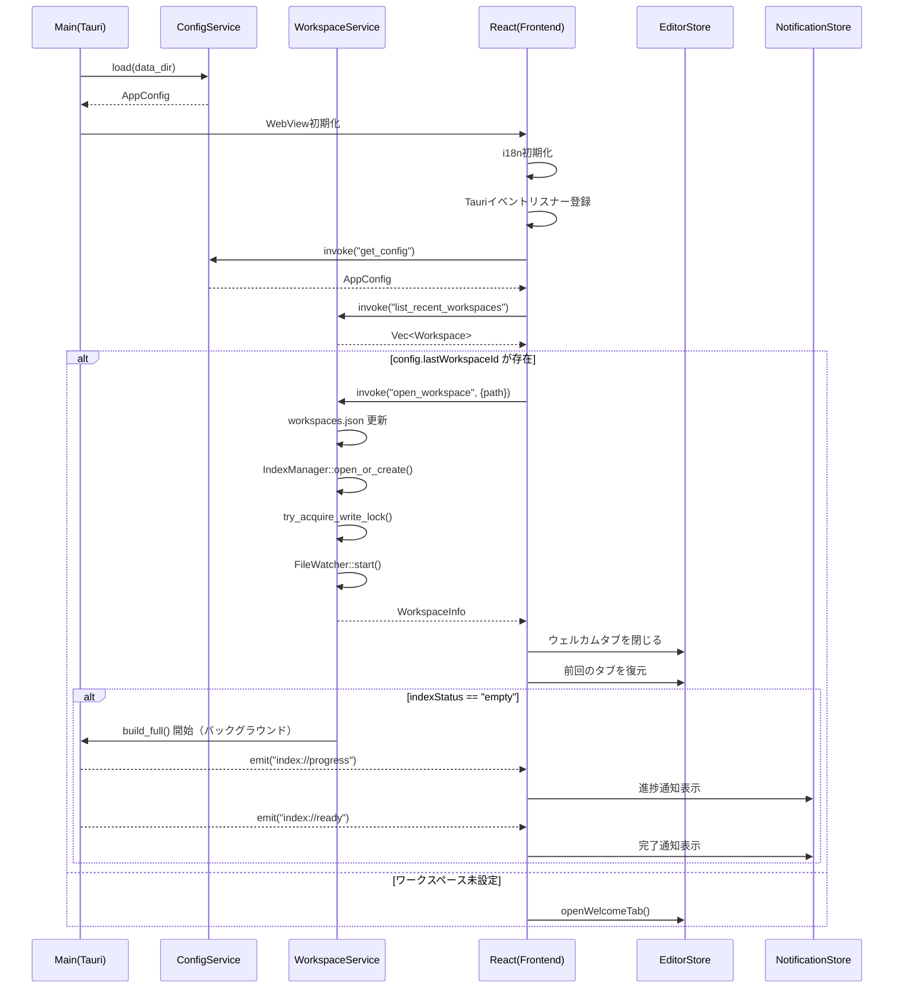
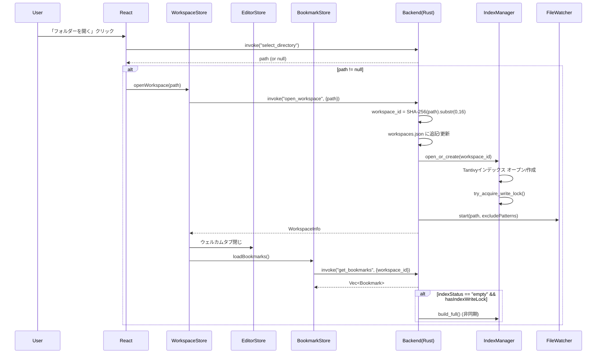
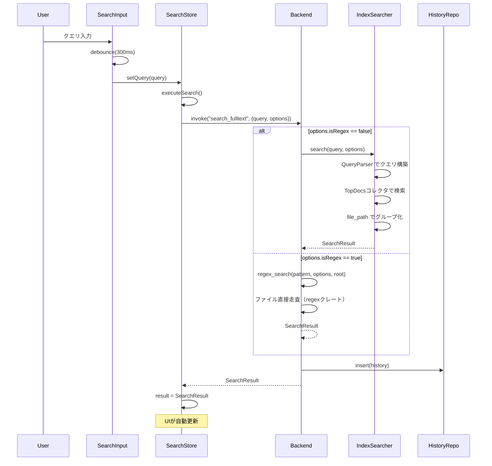
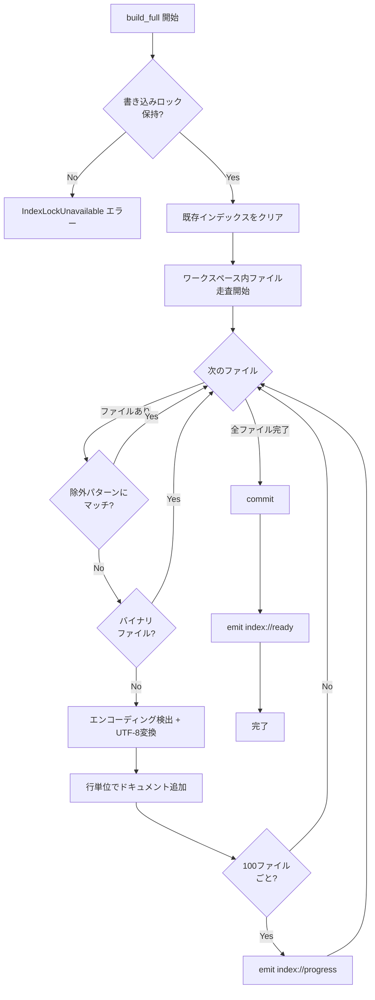
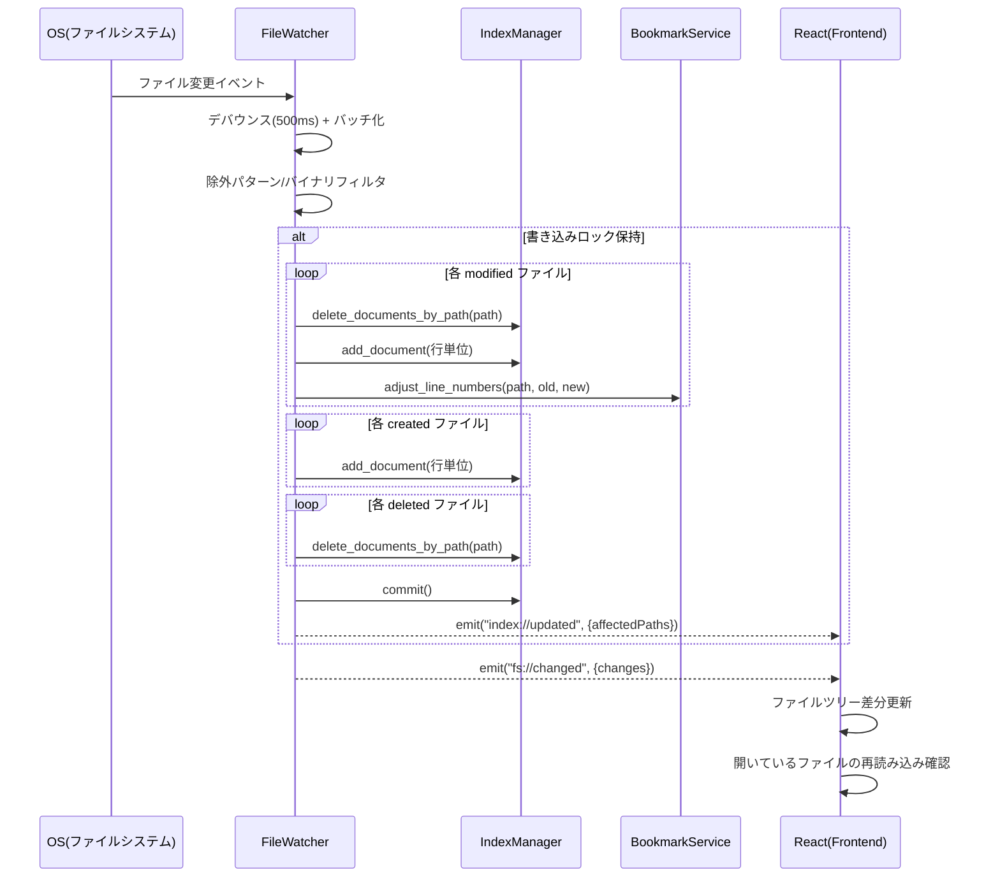
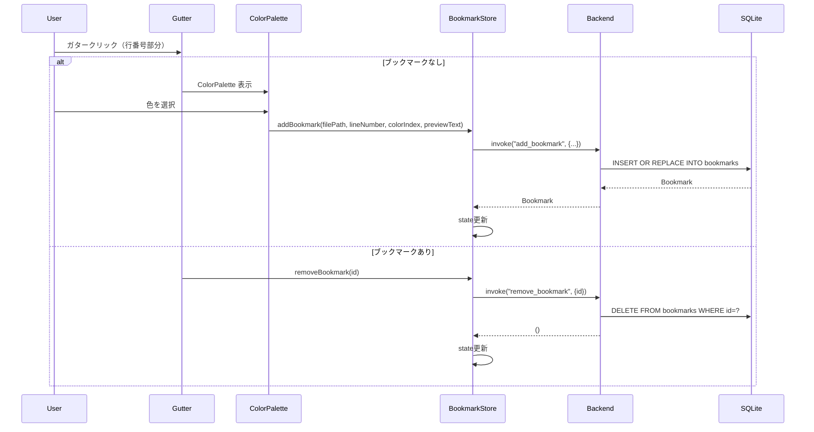
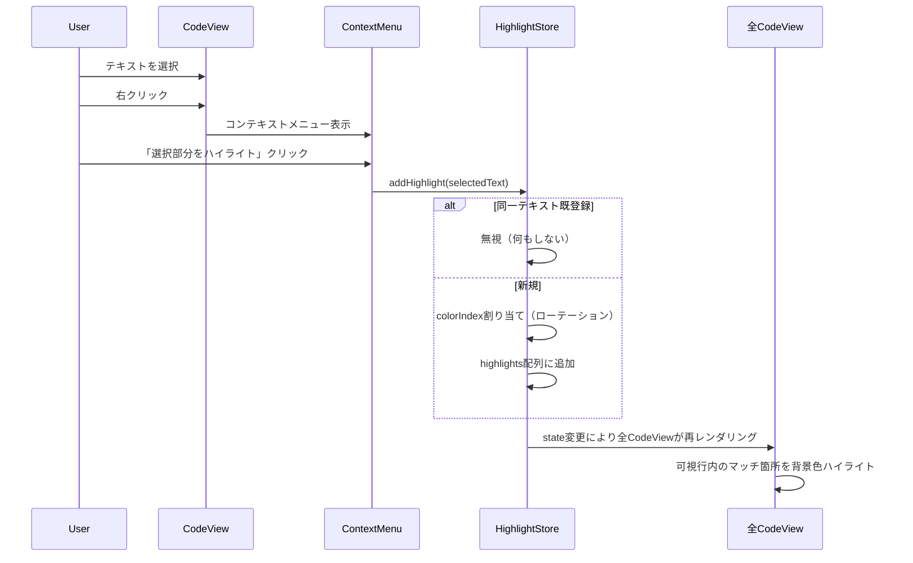
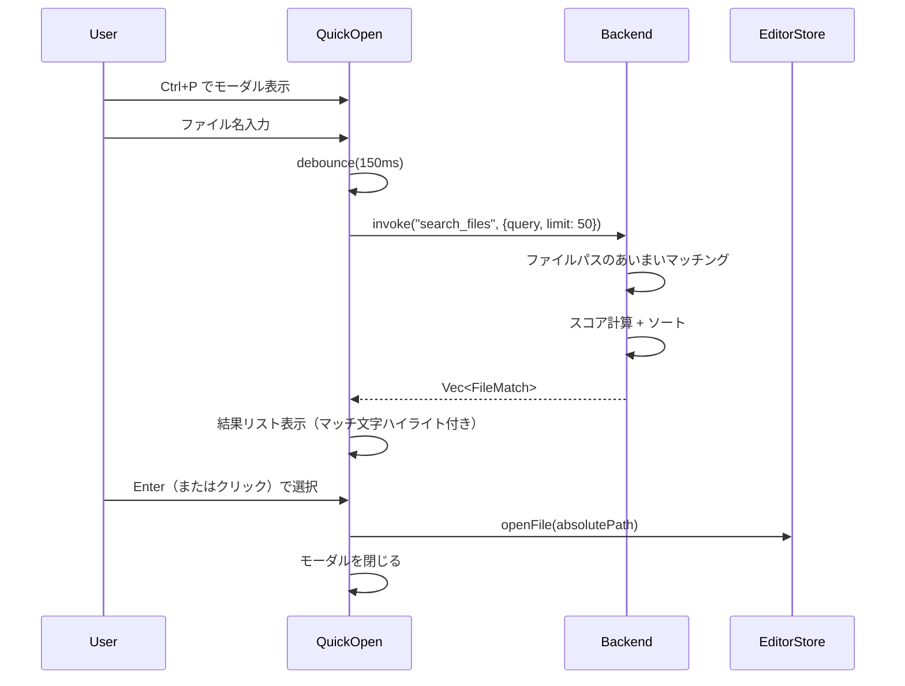
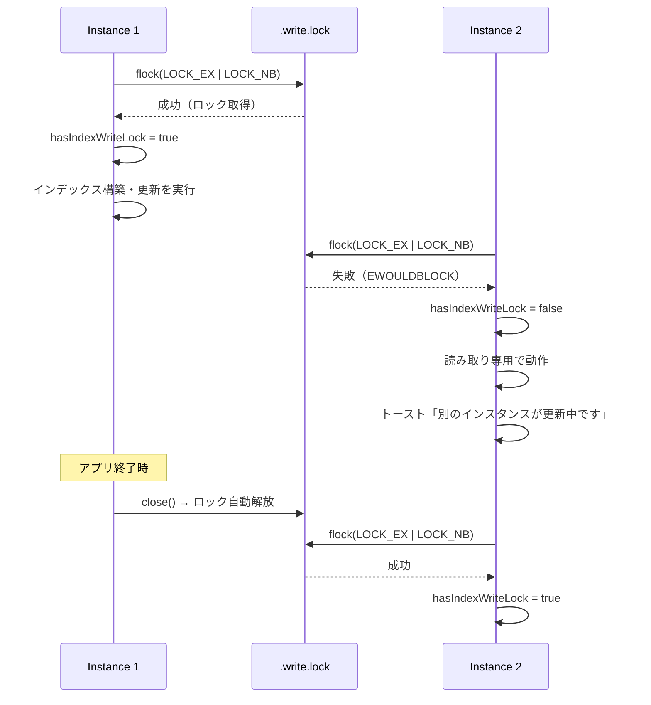

# 07. 処理フロー

主要ユースケースのシーケンス図・フローチャートをMermaid記法で記述する。

---

## 1. アプリケーション起動

---

## 2. ワークスペースを開く

---

## 3. 全文検索

---

## 4. インデックス構築

---

## 5. ファイル変更のリアルタイム反映

---

## 6. ブックマーク操作

---

## 7. ハイライトワード操作

---

## 8. クイックオープン

---

## 9. 複数インスタンスのインデックスロック

